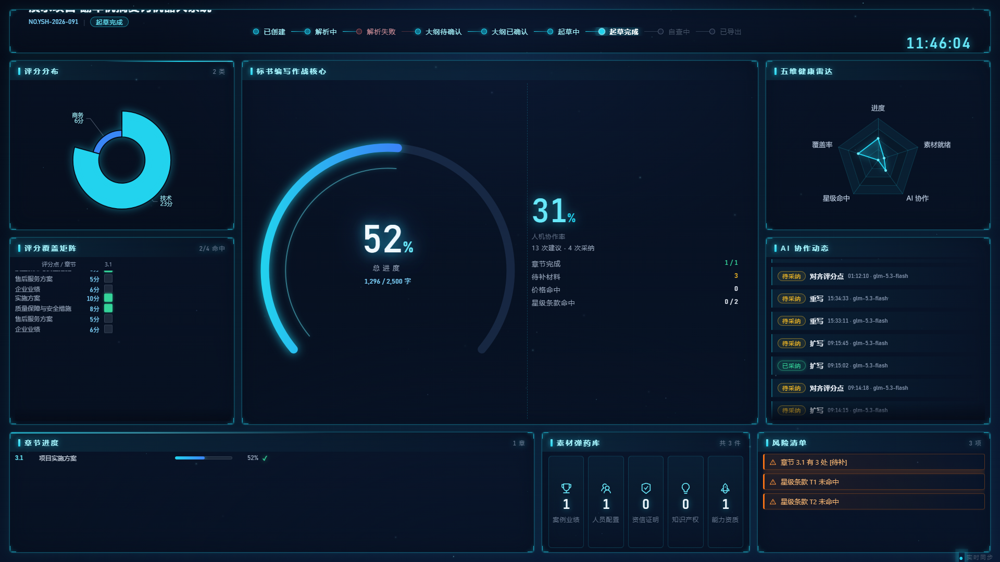

# 投标作战大屏（酷炫可视化）设计与实现

> 产品理念：把一个项目的标书作战全貌——状态机走到哪、总进度多少、评分点覆盖如何、AI 协作了什么、还欠哪些风险——压缩进一块 1920×1080 的深空科技风大屏，供投屏演示与指挥室一屏总览。一个只读聚合接口 + 一张独立全屏画布，不动状态机、不建表、无副作用。



## 设计方案

### 1. 背景与受众

- **背景**：系统已有九大功能页（项目列表/驾驶舱/大纲/章节编辑/交付/素材库/copilot 等），但都是「工作台」视角——操作者低头干活用。缺一个「抬头看」的视角：评委、领导、投屏演示场景下，需要一块不用鼠标、不用点页面，5 秒轮询自动刷新、自解释的可视化大屏。
- **受众**：
  - 演示/汇报场合的观众（最重要）：不熟悉系统也能看懂「做到哪了、好不好、还有什么坑」；
  - 投标团队负责人：挂在办公室大屏上持续盯进度与风险；
  - 开发者本人：作为 showcase 的「颜值担当」页，集中展示数据打通后的全链路可视化能力。
- **形态决策**：独立路由 `/screen/:id`、新标签页全屏打开（不嵌在带 antd 头部的工作台 Shell 里），1920×1080 固定设计画布按视口等比缩放——大屏是「一幅画」，不是「一个网页」。

### 2. 信息架构（顶栏 / 左中右三列 / 底部横条，共 9 个面板）

```
┌──────────────────────────── 顶栏（84px）────────────────────────────┐
│ 项目名(22px 实心亮字) · NO.招标编号 · 状态chip │ 9步流程灯 │ 实时时钟+日期 │
├──────────────┬──────────────────────────────┬──────────────┤
│ 左列 432px    │ 中央（flex 自适应）            │ 右列 432px    │
│ ① 评分分布    │ ④ 标书编写作战核心            │ ⑥ 五维健康雷达 │
│   发光玫瑰图  │   环形总进度仪表(74px 大数字)   │   进度/覆盖率/ │
│ ② 评分覆盖矩阵│   + 人机协作率% + 4 行指标     │ ⑦ AI 协作动态  │
│   自动轮播    │   （章节完成/待补/价格/星级）   │   无限上滚     │
├──────────────┴──────────────────────────────┴──────────────┤
│ 底部横条（232px）：⑧ 章节进度(flex) │ 素材弹药库(400px) │ 风险清单(448px)│
└─────────────────────────────────────────────────────────────┘
                                   右下角：「● 实时同步」呼吸角标
```

- **顶栏**：左块项目身份（项目名/编号/状态 chip），中间状态机流程灯（`flow` 全步骤：走过的亮青、当前步呼吸、`parse_failed` 异常分支红系差异化），右侧 HH:mm:ss 实时时钟（`ScreenPage.tsx:324-339`）。
- **左列**：评分分布玫瑰图（分值合计按 category 聚合，`ScreenPage.tsx:345-358`）＋评分覆盖矩阵轮播（`ScreenPage.tsx:349-358`、`CoverageHeatmap.tsx:67-98`）。
- **中央**：第一视觉锚点——总进度环形仪表（总字数/目标字数）叠 74px count-up 大数字与「N / M 字」副标；右半区人机协作率 apply_rate% 大数字 +「N 次建议 · M 次采纳」+ 章节完成/待补材料/价格命中/星级条款命中四行指标（`ScreenPage.tsx:362-410`）。
- **右列**：五维健康雷达（进度/覆盖率/星级命中/AI 协作/素材就绪度，`ScreenPage.tsx:414-420`）＋ AI 协作动态无限上滚列表（`CopilotFeed.tsx`）。
- **底部横条**：章节进度（key+标题+过渡动画进度条+完成✓，两列网格可滚动，`ScreenPage.tsx:425-451`）＋素材弹药库五类计数（`ScreenPage.tsx:453-463`）＋风险清单（橙呼吸条，空则绿色「暂无风险」，`ScreenPage.tsx:465-480`）。

### 3. 数据契约：`GET /api/projects/{project_id}/screen-data`

单接口一次拉全（`backend/app/api/screen.py:132-135`），只读实时计算、幂等无副作用、需 JWT、项目不存在 404。响应模型 `ScreenDataOut`（`screen.py:112-123`）与前端 `frontend/src/api.ts:523-609` 逐字对齐：

| 字段 | 类型 | 说明 / 后端口径 |
|---|---|---|
| `project` | `{id, name, tender_no, state, updated_at}` | 项目身份；updated_at 为 ISO 串 |
| `flow` | `list[str]` | 状态机全步骤 key 序列，= `PROJECT_STATES`（`screen.py:283`） |
| `current_step_index` | `int` | 当前 state 在 flow 中的下标，非法定位回退 0（`screen.py:284`） |
| `summary.total_words / target_words` | `int` | 有正文章节才计字数（同 export 口径）；目标为各章 target_words 之和（`screen.py:157-178`） |
| `summary.done_chapters / total_chapters` | `int` | 有最新版本正文的章数 / 全部章数 |
| `summary.pending_gaps` | `int` | `[待补…]` 正则计数（`screen.py:28`，照抄 run_check 内联模式） |
| `summary.price_hits` | `int` | 价格表述正则计数（`screen.py:29`） |
| `summary.star_reqs / star_hit` | `int` | 星级条款总数 / 命中数（复用 `extract_hard_keywords` + `find_keyword_hits`，判定语义同 run_check ★节，`screen.py:180-197`） |
| `score_dist` | `list[{category, score, count}]` | 评分点按 category 聚合：分值和（round 2 位）+ 条数，按分值和降序（`screen.py:199-209`） |
| `coverage.chapters` | `list[{key, title}]` | 列=章节，build_coverage 压平（`screen.py:211-231`） |
| `coverage.items` | `list[{key, item, score, cells}]` | `cells` 为 **str 逗号拼接串**（如 `"covered,none"`），`split(",")` 后与 `coverage.chapters` 下标对齐，取值 `covered/partial/none`（`screen.py:66、222`） |
| `coverage.summary` | `{covered, partial, none}` | 行级统计（同交付页覆盖矩阵口径） |
| `chapters` | `list[{key, title, words, target, state}]` | 每章最新版本字数/目标/状态，按 sort_order |
| `copilot.total / applied / apply_rate` | `int / int / float` | 全量统计，apply_rate=applied/total round 3 位，空表 0.0（`screen.py:233-247`） |
| `copilot.recent` | `list[{action, applied, at, model, instruction}]` | 最近 10 条，时间倒序（`screen.py:236-242`） |
| `materials` | `{case, person, credential, ip, capability}` | 全局素材库按 type 计数，五类固定键缺省 0（`screen.py:259-263`） |
| `risks` | `list[str]` | 中文风险描述：待补章节/未命中星级条款/价格表述，封顶 6 条（`screen.py:265-273`） |

前端接入：`api.ts:611` `getScreenData(id)` 复用既有 `request` 帮助函数；`ScreenPage.tsx:89-94` `useQuery(['screen', pid])` + `refetchInterval: 5000` 轮询。

### 4. 酷炫要素清单（以实际落地实现为准）

| # | 要素 | 实现 |
|---|---|---|
| 1 | 深空蓝黑多层渐变背景 | 三层渐变叠加（径向×2 + 线性），`screen.css:8-11` |
| 2 | canvas 星空粒子星幕 | 80~120 粒子按面积自适应（`(w*h)/20000` 夹逼），缓慢漂移+相位闪烁+大粒子光晕，rAF 驱动，卸载 cancel + ResizeObserver disconnect，零三方库（`Starfield.tsx:37、57-89`） |
| 3 | 极淡网格扫描线底纹 | 双向 repeating-linear-gradient + 径向 mask，`screen.css:26-35` |
| 4 | 玻璃拟态面板 | 半透明深底 + `backdrop-filter: blur(10px)` + 青色 1px 描边 + 外发光 box-shadow，`screen.css:64-81` |
| 5 | SVG 四角描角 | 每个 Panel 四角 SVG path + drop-shadow，`Panel.tsx:15-21`、`screen.css:104-117` |
| 6 | 面板顶部周期扫光 | 1.5px 光带 7s 循环，各面板 `--sweep-delay`（0~4s）错峰，`screen.css:83-102` |
| 7 | 入场动画 | opacity 0→1 + translateY(12px)→0，面板间 delay 90ms 递增，`screen.css:153-161`、`Panel.tsx:29` |
| 8 | 环形总进度仪表 | 青→蓝渐变弧 + shadowBlur 发光 + roundCap + 内圈 76% 回声环，`ScreenPage.tsx:142-211` |
| 9 | count-up 大数字 | 74px 发光数字，900ms ease-out cubic 滚动，`screen.css:325-331`、`useCountUp.ts` |
| 10 | 发光玫瑰图 | roseType radius + 分色发光描边 + 深色 tooltip，`ScreenPage.tsx:214-248` |
| 11 | 五维健康雷达 | 发光描边 + 面积填充 + 分区着色，radius 58%，`ScreenPage.tsx:251-295` |
| 12 | 覆盖矩阵自动轮播 | 表头固定 + 行区匀速上滚（每行约 3.2s，行多自动减速）+ 底部渐隐 + hover 暂停，`CoverageHeatmap.tsx:67-98`、`screen.css:353-374` |
| 13 | AI 动态无限上滚 | CSS marquee 内容复制两份无缝循环 + 底部渐隐 + hover 暂停，`CopilotFeed.tsx:23-27`、`screen.css:406-421` |
| 14 | 流程灯三态 | 走过亮青 + 当前步呼吸 `sc-breathe` + 未来步暗置，`screen.css:198-247` |
| 15 | 异常分支红系差异化 | `parse_failed` 暗红空心不点亮为正向里程碑，成为当前态时 `sc-breathe-red` 呼吸告警，`FlowSteps.tsx:11`、`screen.css:249-278` |
| 16 | 风险条橙色呼吸 | `sc-risk-blink` 3.2s 循环，nth-child 错相，`screen.css:498-516` |
| 17 | 章节进度条 | 0.8s cubic 过渡 + 满格变绿渐变 + ✓ 发光，`screen.css:465-476` |
| 18 | 实时时钟 | 每秒 setInterval 跳动，Bahnschrift/Consolas 等宽数字栈 `sc-num`，`ScreenPage.tsx:42-60`、`screen.css:58-62` |
| 19 | 等比缩放画布 | 1920×1080 固定画布按 `min(视口宽/1920, 视口高/1080)` transform:scale 居中，resize 监听，任意窗口不破版，`ScreenPage.tsx:96-104` |
| 20 | 实时同步角标 | 右下角「● 实时同步」呼吸点，接口异常时变「接口待接入 · 5s 自动重试」，`ScreenPage.tsx:484-492`、`screen.css:533-543` |

## 执行方案

### 1. 改动文件清单

| 文件 | 状态 | 作用 |
|---|---|---|
| `backend/app/api/screen.py` | 新建 | 唯一后端文件：`/api/projects/{project_id}/screen-data` 路由 + 全部 Out 模型 + 单函数聚合（章节进度/星级命中/评分分布/覆盖压平/copilot 统计/素材计数/风险清单），复用 `check_service` 的 `build_coverage / latest_contents / extract_hard_keywords / find_keyword_hits`，与自查报告同一套判定语义（`screen.py:18-23、138-139`） |
| `backend/app/main.py` | 2 行 | 注册路由：`from app.api import screen`（:17）+ `app.include_router(screen.router)`（:54） |
| `frontend/src/api.ts` | 追加段 | 大屏类型 `ScreenDataOut` 等 9 个 interface（与后端契约逐字对齐，`cells: string` 注明与 chapters 下标对齐，`api.ts:521-609`）+ `getScreenData(id)`（:611） |
| `frontend/src/pages/ScreenPage.tsx` | 新建 | 大屏页面：缩放画布、时钟、count-up、三个 echarts option（仪表/玫瑰/雷达）、9 面板布局、全部派生数据 `num()/text()` 回退 |
| `frontend/src/components/screen/Panel.tsx` | 新建 | 面板容器：标题条 + 四角描角 + 扫光/入场 delay 参数 |
| `frontend/src/components/screen/Starfield.tsx` | 新建 | canvas 星幕（见酷炫要素 #2） |
| `frontend/src/components/screen/FlowSteps.tsx` | 新建 | 状态机流程灯，`ERROR_STATES = {'parse_failed'}` 异常分支差异化 |
| `frontend/src/components/screen/CopilotFeed.tsx` | 新建 | AI 协作动态上滚列表，`COPILOT_ACTION_LABEL` 动作中文名 |
| `frontend/src/components/screen/CoverageHeatmap.tsx` | 新建 | 覆盖矩阵轮播热力图，`cellAt` 兼容数组/JSON 串/逗号串三种 cells 形态（:13-30） |
| `frontend/src/components/screen/echartsSetup.ts` | 新建 | echarts 按需注册 + `useEChart` 生命周期 hook |
| `frontend/src/components/screen/useCountUp.ts` | 新建 | 数字滚动 hook（ease-out cubic） |
| `frontend/src/components/screen/screen.css` | 新建 | 大屏全部样式（约 540 行，独立于 antd 体系） |
| `frontend/src/App.tsx` | 最小增量 | `RequireAuthFullscreen` 守卫（:64-68）+ `/screen/:id` 路由（:84-86） |
| `frontend/src/pages/ProjectDetailPage.tsx` | 最小增量 | 操作区「作战大屏」按钮，`window.open('/screen/'+pid, '_blank')` 新标签打开（:98-100） |

### 2. 验证方式

1. **后端编译**：`cd backend && ../.venv/Scripts/python.exe -m compileall -q app`。
2. **契约冒烟**：起临时服务（自验轮 8002，前端联调轮 8003），登录拿 JWT 后跑 `python tools/smoke_screen_api.py`——逐字段比对 `ScreenDataOut` 契约（缺失字段收集为 `missing`，非空即退出码非 0）；另做嵌套字段、cells 与 chapters 下标对齐、recent 倒序、risks ≤6 条的深度校验，以及 401（无 token）/404（不存在项目）分支。验证完 kill 临时端口，8000 主服务全程不动。
3. **前端构建**：`cd frontend && npm run build`（tsc -b + vite build）。
4. **Playwright 截图**：`python tools/shot_screen.py` 以 1920×1080 无头截图到 `.screen-qa/`，另对 `/screen/999`（不存在项目）截降级图确认 0 值占位不破版。
5. **视觉评审轮次**：r1 截图评审找阻断项 → 修复 → r2 复验截图逐面板复核（可读性/裁切/重叠/空白/NaN），两轮均留档 `.screen-qa/shot-r1.png、shot-r2.png`。

## 完成结果

（2026-09-12 实现阶段完成后补写；截图为最终 r2 复验版）

### 1. 构建与冒烟结论

- 后端 `compileall` 通过；8002 契约冒烟 `tools/smoke_screen_api.py` 退出码 0 且 `missing=[]`，嵌套字段/cells 对齐/recent 倒序/risks≤6 深度校验与 401/404 检查全过，8002 已杀、8000 未动。
- 前端 `npm run build`（tsc -b && vite build）退出码 0。
- 8003 前端联调轮契约冒烟通过，真实数据：`draft_done` 状态 / 13 条 copilot 记录 / 4 个评分点 / 3 条风险。

### 2. 视觉评审：通过（r1 发现缺陷 → 修复 → r2 复验）

r1 轮 Playwright 截图发现状态角标定位缺陷（`.sc-boot` 漂移压到顶栏），修复为落在画布底部 18px 内边距带内（`screen.css:533-543` 注释即此遗留说明）后复验通过。第 1 版评审的三个阻断项全部修复：

1. **顶栏项目名由渐变虚影改为实心亮字**：`#eaf6ff` 22px 加粗 + 青色光晕 `rgba(34,211,238,0.45)` + 黑色投影 `rgba(0,0,0,0.6)` 兜底（`screen.css:175-184`，注释言明不依赖 `background-clip:text` 渐变填充，截图/投屏合成下必然可读）。视觉复核两轮逐字可读且确认无裁切。
2. **「解析失败」异常分支不再点亮为正向里程碑**：`parse_failed` 节点暗红空心圆点 + 暗红标签 + 暗红连线（`screen.css:249-264`），成为当前态时切换红色呼吸告警 `sc-breathe-red`（`screen.css:265-278`），与青色完成态区隔清晰；异常态集合收敛在 `FlowSteps.tsx:11` 单点定义。
3. **评分覆盖矩阵升级为自动轮播**：表头固定 + 行区匀速向上滚动（行多自动减速，每行约 3.2s，`Math.max(20, items.length * 3.2)`，`CoverageHeatmap.tsx:78`）+ 底部渐隐 + hover 暂停（`CoverageHeatmap.tsx:67-98`、`screen.css:353-374`）——大屏无鼠标也能看全 17 行评分点。

### 3. 整体视觉结论

- **深色科技风完全成立**：深空蓝多层渐变 + 星空粒子 + 扫描网格底纹、玻璃拟态 blur 面板、青色发光描边 + SVG 四角描角、各面板错峰顶部扫光；雷达图缩小留白（radius 68%→58%，`ScreenPage.tsx:256`）后呼吸感更好。
- **数据完整真实**：9 个面板全部有数据——发光玫瑰图、覆盖矩阵轮播、中央仪表 52% 总进度 + 字数 1296/2500、五维雷达、AI 动态 7 条上滚、章节进度带 ✓、素材五类计数、风险清单 3 条橙色呼吸条；右下角「实时同步」呼吸角标亮起，无空白面板/NaN/undefined/报错文案/登录页。
- **布局平衡无重叠溢出**：顶栏（项目名 + 9 步流程灯 + 发光时钟）/左中右三区/底部三段横条层级清晰；中央 74px 发光大数字（`screen.css:325-331`）为第一视觉锚点，当前步白字发光 + 呼吸圆点，Bahnschrift 等宽数字统一科技感。

### 4. 后端实现备注

- **数据来源**：`flow` 来自 `PROJECT_STATES`、`current_step_index` 由 `p.state` 定位（`screen.py:283-284`）；章节/版本/copilot/素材/评分点/星级条款各走独立查询；覆盖矩阵、最新正文、硬指标关键词、关键词命中复用 `check_service` 的 `build_coverage`、`latest_contents`、`extract_hard_keywords`、`find_keyword_hits`（`screen.py:18-23`），与自查报告同一套判定语义；`[待补]` 与价格正则照抄 `run_check` 内联模式原样复用（`screen.py:27-29` 注释言明）。
- **唯一契约解读**：`coverage.items[].cells` 类型为 `str` 且要求与 `chapters` 下标对齐、取值 `covered/partial/none`——实现为逗号拼接串（如 `"covered,none"`，`screen.py:222`），`cells.split(",")` 即与 `coverage.chapters` 下标对齐，三项约束同时满足；其余字段名与结构与契约逐字一致。前端 `cellAt` 兼容数组/JSON 串/逗号串三种形态，越界或脏值按 none（`CoverageHeatmap.tsx:13-30`），后端契约演进时前端不脆断。

### 5. 前端实现特性

- **路由与守卫**：`/screen/:id` 走 `RequireAuthFullscreen`（`App.tsx:64-68`）——同样校验 token、无 token 跳 /login，但**不套 Shell 布局**：Shell 的 antd 头部 + 1080px 内容区会破坏 1920×1080 全屏画布；入口为 ProjectDetailPage 操作区「作战大屏」按钮（`FundProjectionScreenOutlined`，`window.open('/screen/'+pid, '_blank')`，`ProjectDetailPage.tsx:98-100`），App.tsx/ProjectDetailPage 仅最小增量改动，未动后端其余文件，未 git 提交（screen.py、ScreenPage.tsx、components/ 等均为工作区未跟踪/未暂存文件）。
- **缩放适配**：1920×1080 固定设计画布，外层按 `min(视口宽/1920, 视口高/1080)` transform:scale 居中，resize 监听（`ScreenPage.tsx:96-104`），任意窗口不破版。
- **背景层**：深空蓝黑径向渐变（`#050b18→#0a1a35`）+ canvas 自绘粒子星幕（80~120 粒子按面积自适应，缓慢漂移 + 闪烁 + 大粒子光晕，requestAnimationFrame 驱动，卸载 cancel + ResizeObserver disconnect，零三方库）+ 极淡网格扫描线叠加（`screen.css:4-35`）。
- **echarts 接入**：echarts ^6.1.0（`package.json:22`）按需引入（`echarts/core` + GaugeChart/PieChart/RadarChart + CanvasRenderer，无整包 import，`echartsSetup.ts:3-9`）；`useEChart` hook 统一管理实例：init 一次、setOption merge 更新（数据刷新走过渡动画而非重绘，避免 5s 轮询整页闪白）、卸载 dispose、`devicePixelRatio ≥ 2` 保证 scale 放大后清晰（`echartsSetup.ts:19-37`）。
- **数据与稳健性**：`useQuery` refetchInterval=5000 轮询、retry 1（`ScreenPage.tsx:89-94`）；所有数值经 `num()` 回退 0、字符串回退「—」、数组 `filter(Boolean)`、除零防护（`ScreenPage.tsx:26-36`），接口未就绪/404 时整屏 0 值占位不白屏；组件卸载清理全部 echarts 实例/rAF/interval/ResizeObserver。
- **中央仪表**：总进度 = total_words/target_words（上限 100%），220°→-40° 环形 + 青蓝渐变 + shadowBlur 18 发光 + 内圈 76% 回声环；中心 `useCountUp` 900ms ease-out cubic 大数字（`ScreenPage.tsx:64-65、142-211`）。
- **五维雷达口径**：进度/覆盖率/星级命中/AI 协作取各自比率，素材就绪度 = min(五类总数/20, 1)（`ScreenPage.tsx:123-125、277-283`）。
- **AI 动态条目**：采纳状态标签（已采纳/待采纳）+ 动作中文名 + HH:mm:ss 时间 + 模型 + 指令摘要，复制两份无缝上滚、条目越多滚得越慢（`CopilotFeed.tsx:23-27`）。

### 6. 验证记录

| 项 | 命令/方式 | 结论 |
|---|---|---|
| 后端编译 | `compileall -q app` | 通过 |
| 契约冒烟（自验轮） | 8002 + `tools/smoke_screen_api.py` | 退出码 0、missing=[]；深度校验（嵌套字段/cells 对齐/倒序/≤6 风险）与 401/404 全过；8002 已杀、8000 未动 |
| 前端构建 | `cd frontend && npm run build` | 退出码 0 |
| 契约冒烟（联调轮） | 8003 + `tools/smoke_screen_api.py` | 通过（draft_done/13 条 copilot/4 评分点/3 风险） |
| Playwright 截图 | `tools/shot_screen.py` 1920×1080 → `.screen-qa/shot-r1.png、shot-r2.png` | r1 发现 `.sc-boot` 漂移压顶栏缺陷并修复，r2 复验通过（本文档头图即 shot-r2） |
| 降级截图 | `/screen/999` | 0 值占位、无破版 |
| 清理 | — | 8003 已杀、8000 未动且健康 |

### 7. 已知限制

- 大屏需登录后访问（RequireAuthFullscreen 校验 token，无 token 跳 /login）。
- 展示数据来自演示项目 1；`materials` 为全局素材库计数（非项目级维度）。
- 动画效果（星幕漂移、扫光、呼吸、轮播、count-up）为时序体验，静态截图仅能呈现构图与配色，需实际打开 `/screen/:id` 页面体验。
- 全部改动未 git 提交（工作区未跟踪/未暂存状态）。
